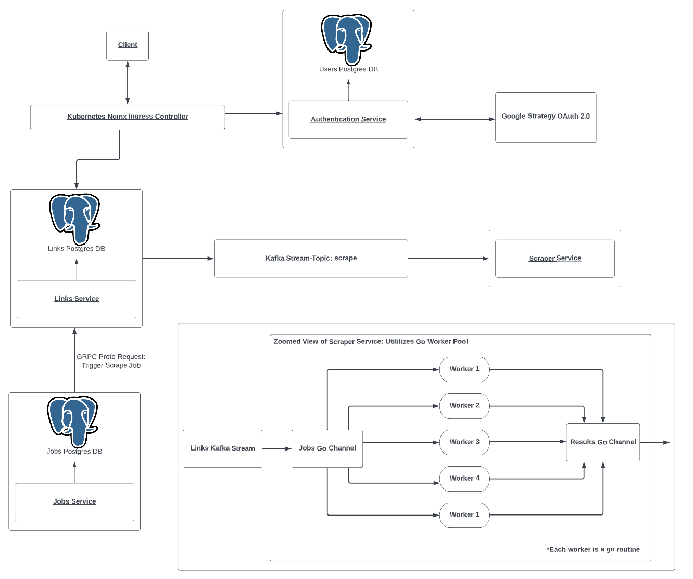

# Pricey
A distributed system application to scan for price drops.
## Architecture

### Language
* Golang
### DevOps
* Docker used for containerization
* Kubernetes used for orchestration
* Nginx Ingress Controller for loadbalancing. Allows for traffic to be directed to appropriate services and ingress level authentication.
* OAuth 2.0 using the Google Strategy
### Messaging
* Kafka streams for streaming links into scraper service for processing
* GRPC to trigger jobs when needed
### Database
* Postgres Database to keep track of users, links, jobs
### Microservices
* Authentication Service
  * Handles logins, registration and authentication
  * Users are authenticated using OAuth 2.0 Google Strategy
* Link Service
  * Users can upload links to websites to scrape prices of
  * Sends links to scrape service through Kafka Streams when triggered
* Jobs Service
  * Checks the jobs database for any scheduled jobs
  * Triggers a GRPC call to links service when the scrape job is triggerd
* Scrape Service
  * Worker Pool service to execute the scraping of links 
  * Utilizes go concurrency concepts such as go channels, go routines and wait groups
  * Links are fed in by a Kafka stream
### Features left to implement
* Scraping of prices and ingestion of results to a prices database
* Subscription mechanism for price alerts
* Chrome extension
### To Explore in The Future
* Sharding databases
* Cloud deployments
* Redis 
  * Failover
  * Timed expiration of cache (Remove frome cache if user has not logged in for eg. 30 days)
* Cassandra Database
* Vault/Secret Management
* Distributed Logging (eg. Elastic)

